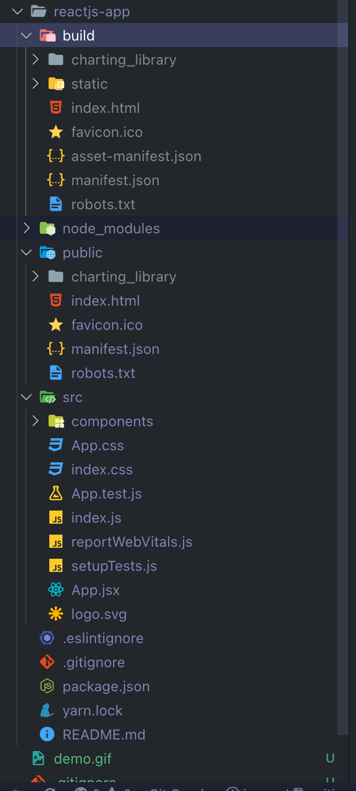
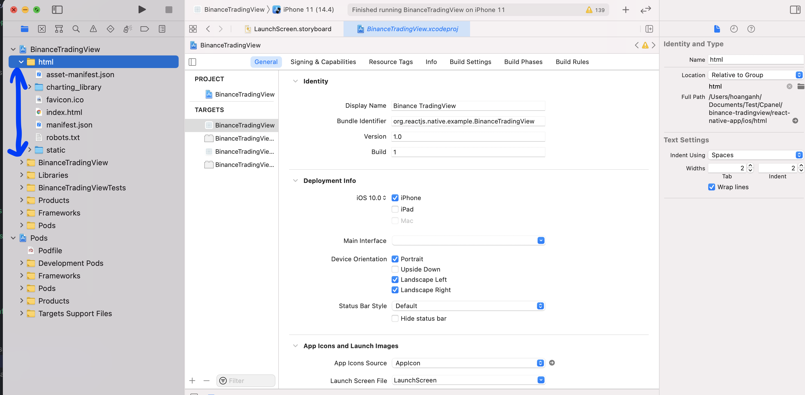

# Trading view demo

## Demo

## Prerequisites

### Project structure

    .
    ├── react-native-app
    ├── reactjs-app

- react-native-app: React native application
- reactjs-app: Custom TradingView and data source implementation can be run as a standalone website or render using react native webview. Make it easy for development.

### Install dependencies

> react-native-app

    yarn install
    yarn pod:install

> reactjs-app

First, you need to copy the `charting_library` folder inside the charting library project into the public folder of `reactjs-app`.

    yarn install
    yarn start # to run the web app on localhost:3000

### Deployment

At `reactjs-app` run:

    yarn build

Then open xcode and add all the files inside `reactjs-app/build` folder to the `html` group in xcode project.
All set we can run the application derectly in xcode and test the result.

**React js build folder output after running `yarn build`**

>

**Xcode prject structure after adding all the files from the `build` folder to its html group**

> 
